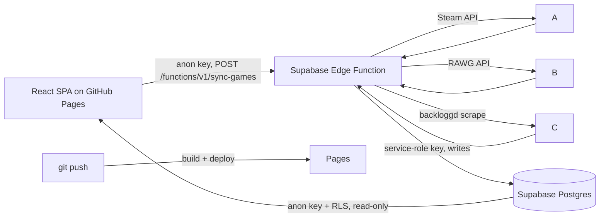

# Gaming Backlog — Setup &amp; Architecture

A static, GitHub Pages–hosted dashboard for your gaming backlog. Data lives in **Supabase** and is read live by the site. A **Sync now** button on the page calls a **Supabase Edge Function** that fetches Steam + RAWG + backloggd and writes straight to Postgres. GitHub Actions only deploys the static site on push — it's no longer involved in data sync at all.

## How it fits together



- **One server component**: the `sync-games` Edge Function does the whole sync. The site calls it with the anon key it already has.
- **No GitHub PAT, no workflow\_dispatch, no polling, no rebuild-on-sync.** The site reads Supabase live, so after a sync the button just refetches data instantly.
- GitHub Actions is reduced to a standard **build-and-deploy on push** (the official Pages action). No secrets beyond what the build needs.
- Supabase auto-injects `SUPABASE_URL` and `SUPABASE_SERVICE_ROLE_KEY` into edge functions, so you only set **4** function secrets.

## Why this is lighter than the Actions-based version


|                             | Before (Actions sync)                                      | Now (Edge Function sync)       |
| --------------------------- | ---------------------------------------------------------- | ------------------------------ |
| Trigger path                | site → edge fn → GitHub PAT → Actions → rebuild → redeploy | site → edge fn → done          |
| Moving parts                | 2 server pieces + a build cycle                            | 1 server piece                 |
| Secrets in GitHub           | 7 + a GitHub PAT                                           | 2 (build only)                 |
| Time to refresh             | \~1-2 min (full CI build)                                  | a few seconds (just API calls) |
| GitHub Actions minutes used | per sync                                                   | only on code push              |


## Data sources


| Source                | What we get                                                     | Auth                                |
| --------------------- | --------------------------------------------------------------- | ----------------------------------- |
| Steam `GetOwnedGames` | owned games, playtime, last played                              | `STEAM_API_KEY` + `STEAM_ID`        |
| RAWG                  | genres, cover, RAWG rating, release date, **upcoming releases** | `RAWG_API_KEY` (free)               |
| backloggd             | your ratings + status (played/playing/backlog/wishlist/dropped) | scraped, no API                     |
| Epic Game Store       | —                                                               | skipped (no public owned-games API) |


## Repository layout

```
gaming-backlog/
├─ .github/workflows/deploy.yml          # build + deploy site on push (the workflow canvas)
├─ .env.example
├─ index.html
├─ package.json
├─ vite.config.js
├─ tailwind.config.js
├─ postcss.config.js
├─ sync/
│  ├─ package.json
│  └─ sync.mjs                           # OPTIONAL local backfill (first run / big library)
├─ supabase/
│  └─ functions/
│     └─ sync-games/
│        └─ index.ts                     # the sync edge function (the edge canvas)
└─ src/
   ├─ main.jsx
   ├─ index.css
   └─ App.jsx                            # the React app canvas
```

## 1 · Supabase (you already have a project)

1. Run the **Supabase Schema** canvas in the SQL editor. Creates `games`, `library_entries`, `ratings`, `upcoming_releases`, public read-only RLS, and the `recommend_play_next()` / `recommend_discover()` RPCs.
2. Grab **Project URL** and **anon key** from *Settings → API*. (The service-role key is auto-injected into functions; you don't paste it anywhere.)

## 2 · Get API keys &amp; IDs

- **Steam API key:** [https://steamcommunity.com/dev/apikey](https://steamcommunity.com/dev/apikey)
- **Steam ID:** 17-digit ID via [https://steamid.io](https://steamid.io). Profile games list must be **public**.
- **RAWG API key:** free at [https://rawg.io/apidocs](https://rawg.io/apidocs).
- **backloggd username:** the `/u/<username>` part of your profile URL.

## 3 · Deploy the Edge Function (the sync)

```bash
supabase login
supabase link --project-ref <project-ref>
supabase functions deploy sync-games --no-verify-jwt
supabase secrets set \
  STEAM_API_KEY=... \
  STEAM_ID=... \
  RAWG_API_KEY=... \
  BACKLOGGD_USERNAME=...
```

That's the entire data backend. `SUPABASE_URL` and `SUPABASE_SERVICE_ROLE_KEY` are provided to the function automatically. The site calls `POST /functions/v1/sync-games` with the anon key.

> **Edge-function timeout:** Supabase edge functions cap execution (default \~150s, configurable). The function only enriches **new** games with RAWG (capped at 40/call), so routine syncs are fast. For a very large first backfill, run `sync/sync.mjs` locally once (no timeout) — then use the button for ongoing updates.

## 4 · GitHub repo secrets (for the site build only)

*Settings → Secrets and variables → Actions:*

`SUPABASE_URL`, `SUPABASE_ANON_KEY`

And a repo **variable** `VITE_BASE_PATH` = `/` (user pages) or `/<repo-name>/` (project repo). That's it — no Steam/RAWG/service-role/GitHub-PAT here; those live in Supabase.

## 5 · Config files

`package.json` (site root):

```json
{
  "name": "gaming-backlog",
  "private": true,
  "type": "module",
  "scripts": { "dev": "vite", "build": "vite build", "preview": "vite preview" },
  "dependencies": {
    "@supabase/supabase-js": "^2.45.0",
    "react": "^18.3.1",
    "react-dom": "^18.3.1",
    "react-router-dom": "^6.26.0",
    "recharts": "^2.12.7"
  },
  "devDependencies": {
    "@vitejs/plugin-react": "^4.7.0",
    "autoprefixer": "^10.4.20",
    "postcss": "^8.4.41",
    "tailwindcss": "^3.4.10",
    "vite": "^7.3.6"
  }
}
```

`sync/package.json` (optional, local backfill only):

```json
{
  "name": "sync",
  "private": true,
  "type": "module",
  "dependencies": { "@supabase/supabase-js": "^2.45.0", "cheerio": "^1.0.0" }
}
```

`vite.config.js`:

```js
import { defineConfig } from "vite";
import react from "@vitejs/plugin-react";
export default defineConfig({ plugins: [react()], base: process.env.VITE_BASE_PATH || "/" });
```

`tailwind.config.js`:

```js
export default { content: ["./index.html", "./src/**/*.{js,jsx}"], theme: { extend: {} }, plugins: [] };
```

`postcss.config.js`:

```js
export default { plugins: { tailwindcss: {}, autoprefixer: {} } };
```

`src/main.jsx`:

```jsx
import React from "react";
import { createRoot } from "react-dom/client";
import App from "./App";
import "./index.css";
createRoot(document.getElementById("root")).render(<App />);
```

`src/index.css`:

```css
@tailwind base;
@tailwind components;
@tailwind utilities;
```

`index.html`:

```html
<!doctype html>
<html lang="en">
  <head>
    <meta charset="UTF-8" />
    <meta name="viewport" content="width=device-width, initial-scale=1.0" />
    <title>Gaming Backlog</title>
  </head>
  <body class="bg-slate-950">
    <div id="root"></div>
    <script type="module" src="/src/main.jsx"></script>
  </body>
</html>
```

`.env.example` (copy to `.env` for local dev; never commit real keys):

```
VITE_SUPABASE_URL=
VITE_SUPABASE_ANON_KEY=
VITE_BASE_PATH=/
```

## 6 · Deploy

- Push to `main`. The `deploy.yml` workflow builds and publishes to GitHub Pages via the official `deploy-pages` action.
- In **repo Settings → Pages**, set source to **GitHub Actions**.
- Visit the site, hit **↻ Sync now**, and the edge function populates Supabase. The page refetches instantly — no rebuild.

## 7 · The Sync now button

`SyncButton` calls `supabase.functions.invoke("sync-games", { method: "POST" })`:

1. The edge function fetches Steam + RAWG + backloggd and upserts into Postgres.
2. It returns a summary (`games`, `enriched`, `ratings`, `upcoming`, elapsed time).
3. On success, the button bumps a `version` counter and every page's data hook refetches — instant refresh, no reload.

## 8 · Recommendations

Two Postgres RPCs (in the schema canvas), both keyed on **genre affinity** (your average rating per genre across played/playing games):

- **`recommend_play_next(limit)`** — owned games you've barely played (`< 4h`, status backlog/wishlist/playing/dropped), ranked by genre affinity. What to start next.
- **`recommend_discover(limit)`** — upcoming releases you don't own, ranked by the same affinity. New games matching your taste.

Both adapt automatically as you rate more games.

## Notes &amp; caveats

- **No GitHub PAT anywhere.** The PAT-free design is the whole point — secrets stay in Supabase function secrets.
- **backloggd scraping is best-effort** (no official API). If selectors change, update the scrape section in the edge function.
- **Steam → RAWG matching is by title search**; remasters/editions may mismatch. Add a release-year tiebreaker in `rawgSearch()` if needed.
- Backloggd-only games you've rated but don't own on Steam still get `games` + `ratings` rows so they appear in stats.
- For a very large first sync, use the local `sync.mjs` once to avoid the edge timeout; the button handles all routine updates after that.