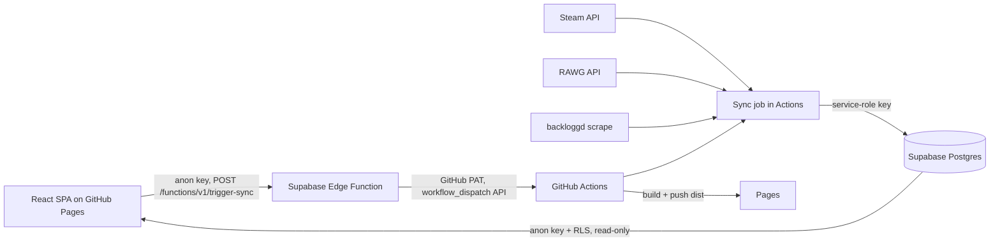

# Gaming Backlog — Setup &amp; Architecture

A static, GitHub Pages–hosted dashboard for your gaming backlog. Data from **Steam**, **RAWG**, and **backloggd** is synced into **Supabase** on demand by **GitHub Actions**; the site reads it back read-only via the anon key + Row Level Security. You trigger a refresh yourself with the **Sync now** button — no scheduled runs.

## How it fits together



- The site is **static** — it can't hold secrets. The **Sync now** button calls a Supabase Edge Function (using only the anon key); the function holds a GitHub PAT server-side and fires the workflow via GitHub's `workflow_dispatch` API.
- Supabase RLS exposes **public read-only** access; the sync uses the **service role** key (bypasses RLS).
- Recommendations are **Postgres RPCs** so they recompute as you rate more games.
- **No schedule** — sync only happens when you click the button.

## Data sources


| Source                | What we get                                                     | Auth                                |
| --------------------- | --------------------------------------------------------------- | ----------------------------------- |
| Steam `GetOwnedGames` | owned games, playtime, last played                              | `STEAM_API_KEY` + `STEAM_ID`        |
| RAWG                  | genres, cover, RAWG rating, release date, **upcoming releases** | `RAWG_API_KEY` (free)               |
| backloggd             | your ratings + status (played/playing/backlog/wishlist/dropped) | scraped, no API                     |
| Epic Game Store       | —                                                               | skipped (no public owned-games API) |


## Repository layout

```
gaming-backlog/
├─ .github/workflows/sync-backlog.yml     # the workflow canvas (manual only)
├─ .env.example
├─ index.html
├─ package.json                           # site deps + build
├─ vite.config.js
├─ tailwind.config.js
├─ postcss.config.js
├─ sync/
│  ├─ package.json                        # sync deps (supabase-js, cheerio)
│  └─ sync.mjs                            # the sync script canvas
├─ supabase/
│  └─ functions/
│     └─ trigger-sync/
│        └─ index.ts                      # the edge function canvas
└─ src/
   ├─ main.jsx
   ├─ index.css
   └─ App.jsx                             # the React app canvas
```

## 1 · Supabase (you already have a project)

1. In the Supabase **SQL editor**, paste the **Supabase Schema** canvas and run it. This creates `games`, `library_entries`, `ratings`, `upcoming_releases`, enables RLS (public read-only), and the `recommend_play_next()` / `recommend_discover()` functions.
2. Copy **Project URL**, **anon key**, and **service\_role key** from *Project Settings → API*. You'll use anon in the site, service\_role in Actions (never in the browser).

## 2 · Get API keys &amp; IDs

- **Steam API key:** [https://steamcommunity.com/dev/apikey](https://steamcommunity.com/dev/apikey)
- **Steam ID:** your 17-digit ID (use [https://steamid.io](https://steamid.io)). Your profile's games list must be **public**.
- **RAWG API key:** free at [https://rawg.io/apidocs](https://rawg.io/apidocs) (instant signup).
- **backloggd username:** your backloggd username (the `/u/<username>` part).

## 3 · GitHub PAT for the manual trigger

The Edge Function needs a token to call GitHub's workflow dispatch API. Use a **fine-grained PAT** (recommended):

1. [https://github.com/settings/personal-access-tokens/new](https://github.com/settings/personal-access-tokens/new) (or a classic token with `repo` + `workflow` scope).
2. Resource owner: the repo owner; repository: your `gaming-backlog` repo.
3. Permissions → **Actions: Read and write** (this grants workflow dispatch). Read on metadata is auto-included.
4. Copy the token (`github_pat_…`). It lives only in Supabase, never in the browser or repo.

## 4 · Deploy the Edge Function

Install the Supabase CLI, then from the repo root:

```bash
supabase login
# link to your project (use the project ref from Settings > API)
supabase link --project-ref <project-ref>

# deploy the function (no-verify-jwt so the anon key is enough)
supabase functions deploy trigger-sync --no-verify-jwt

# set the function's secrets
supabase secrets set GITHUB_PAT=github_pat_xxx
supabase secrets set GITHUB_REPO=owner/gaming-backlog
supabase secrets set WORKFLOW_REF=sync-backlog.yml
supabase secrets set GITHUB_BRANCH=main
```

The site calls `POST /functions/v1/trigger-sync` (anon key in header) → the function fires the workflow and returns the latest run; a `GET` to the same endpoint returns run status for polling.

## 5 · Add repo secrets (for the Actions sync job itself)

*Settings → Secrets and variables → Actions:*

`STEAM_API_KEY`, `STEAM_ID`, `RAWG_API_KEY`, `BACKLOGGD_USERNAME`, `SUPABASE_URL`, `SUPABASE_SERVICE_ROLE_KEY`, `SUPABASE_ANON_KEY`

Also add a repo **variable** `VITE_BASE_PATH` = `/` (for a `user.github.io` repo) or `/<repo-name>/` (for a project repo).

> The GitHub PAT does **not** go in repo secrets — it lives in Supabase function secrets (step 4).

## 6 · Config files

`package.json` (site root):

```json
{
  "name": "gaming-backlog",
  "private": true,
  "type": "module",
  "scripts": { "dev": "vite", "build": "vite build", "preview": "vite preview" },
  "dependencies": {
    "@supabase/supabase-js": "^2.45.0",
    "react": "^18.3.1",
    "react-dom": "^18.3.1",
    "react-router-dom": "^6.26.0",
    "recharts": "^2.12.7"
  },
  "devDependencies": {
    "@vitejs/plugin-react": "^4.3.1",
    "autoprefixer": "^10.4.20",
    "postcss": "^8.4.41",
    "tailwindcss": "^3.4.10",
    "vite": "^5.4.0"
  }
}
```

`sync/package.json`:

```json
{
  "name": "sync",
  "private": true,
  "type": "module",
  "dependencies": {
    "@supabase/supabase-js": "^2.45.0",
    "cheerio": "^1.0.0"
  }
}
```

`vite.config.js`:

```js
import { defineConfig } from "vite";
import react from "@vitejs/plugin-react";

export default defineConfig({
  plugins: [react()],
  base: process.env.VITE_BASE_PATH || "/",
});
```

`tailwind.config.js`:

```js
export default { content: ["./index.html", "./src/**/*.{js,jsx}"], theme: { extend: {} }, plugins: [] };
```

`postcss.config.js`:

```js
export default { plugins: { tailwindcss: {}, autoprefixer: {} } };
```

`src/main.jsx`:

```jsx
import React from "react";
import { createRoot } from "react-dom/client";
import App from "./App";
import "./index.css";

createRoot(document.getElementById("root")).render(<App />);
```

`src/index.css`:

```css
@tailwind base;
@tailwind components;
@tailwind utilities;
```

`index.html`:

```html
<!doctype html>
<html lang="en">
  <head>
    <meta charset="UTF-8" />
    <meta name="viewport" content="width=device-width, initial-scale=1.0" />
    <title>Gaming Backlog</title>
  </head>
  <body class="bg-slate-950">
    <div id="root"></div>
    <script type="module" src="/src/main.jsx"></script>
  </body>
</html>
```

`.env.example` (copy to `.env` for local dev; never commit real keys):

```
VITE_SUPABASE_URL=
VITE_SUPABASE_ANON_KEY=
VITE_BASE_PATH=/
```

## 7 · Build &amp; deploy

- The workflow is **manual-only** (`workflow_dispatch`); it builds the site and pushes `dist/` to the `gh-pages` branch via `peaceiris/actions-gh-pages`.
- In **repo Settings → Pages**, set source to the **gh-pages branch** (`/root`).
- First run: trigger it from the site's **Sync now** button (once the edge function is deployed), or manually under *Actions → Sync gaming backlog → Run workflow*, then enable Pages.

## 8 · The Sync now button

In the app's top nav, **↻ Sync now** calls the edge function:

1. `POST /functions/v1/trigger-sync` → fires the workflow, returns the new run.
2. The button shows **⟳ Syncing…** and polls the run every 8s via `GET /functions/v1/trigger-sync`.
3. When the run completes it flips to **✓ Synced** and prompts a refresh to load the new data.

The whole cycle (sync data → build → deploy gh-pages) takes \~1-2 min; just refresh the page after it reports done.

## 9 · Recommendations

Two Postgres RPCs (in the schema canvas):

- **`recommend_play_next(limit)`** — your owned games that are unplayed/shelved (`< 4h` played, status in backlog/wishlist/playing/dropped), scored by **genre affinity** = your average rating per genre across played/playing games. Ranks what to start next.
- **`recommend_discover(limit)`** — upcoming releases you don't own, scored by the same genre affinity. Reveals new games matching your taste.

Both adapt automatically as the sync adds more ratings; tune the `< 240` minutes threshold or status filter in the SQL to taste.

## Notes &amp; caveats

- **Manual sync only** — no cron, no wasted Actions minutes. The button is the single trigger.
- **The PAT never reaches the browser.** It's a Supabase function secret; the site only ever sends the anon key.
- **backloggd scraping is best-effort** — no official API. If selectors change, update the `cheerio` section in `sync.mjs`.
- **Steam → RAWG matching is by title search**; mismatches are possible for remasters/editions. Refine `rawgSearch()` with a release-year tiebreaker if needed.
- Backloggd-only games you've rated but don't own on Steam still get a `games` + `ratings` row so they appear in stats.